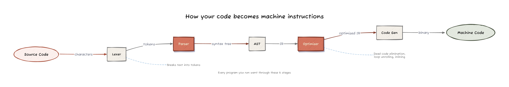
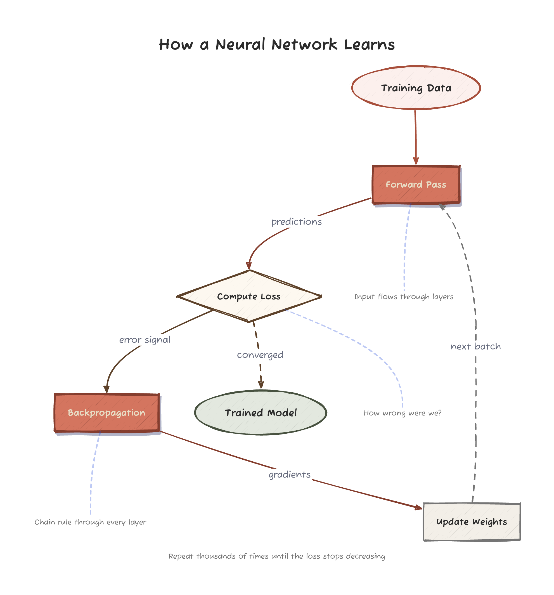
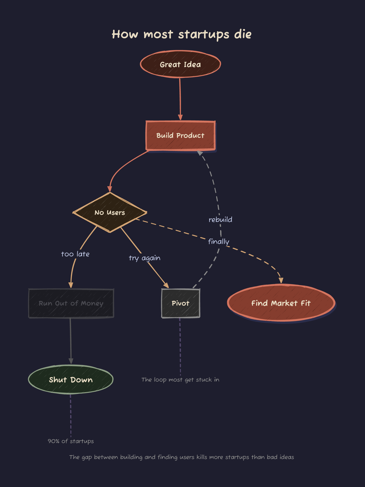
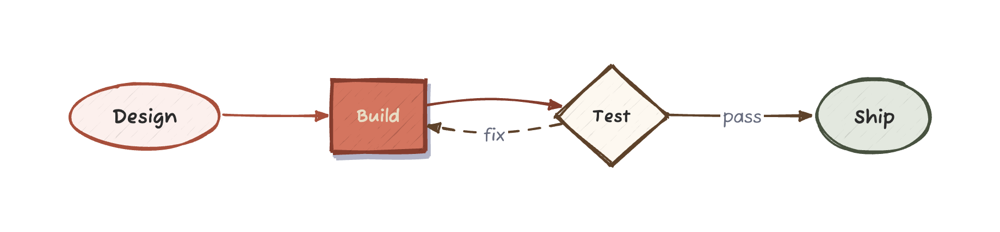

# PlotCraft

**Better diagrams from your AI.** Describe what you want in Python, get a polished hand-drawn diagram back.

<p align="center">
  
</p>

<p align="center">
  
</p>

<p align="center">
  
</p>

## Why?

AI-generated diagrams usually look terrible — misaligned text, arrows through shapes, everything the same size. PlotCraft fixes this with two purpose-built modes:

- **Scene API** for flowcharts → renders via [D2](https://d2lang.com)
- **Canvas API** for spatial compositions → renders via Excalidraw + Playwright

## Install

### Core (Scene API only)

```bash
pip install plotcraft
brew install d2          # rendering engine
```

That's enough for flowcharts via the Scene API.

### With spatial compositions (Canvas API)

```bash
pip install plotcraft[render]
playwright install chromium
brew install d2
```

The `[render]` extra adds Playwright + a headless Chromium for rendering Excalidraw diagrams to PNG/SVG.

### Dependency summary

| Need | Install |
|---|---|
| Scene API → `.d2`/`.excalidraw` files | `pip install plotcraft` |
| Scene API → `.png`/`.svg` (D2 sketch mode) | + `brew install d2` |
| Canvas API → `.excalidraw` files | `pip install plotcraft` |
| Canvas API → `.png`/`.svg` | `pip install plotcraft[render]` + `playwright install chromium` |

## Quick Start

### Flowchart with Scene API

```python
from plotcraft import Scene

s = Scene()
s.add("How a neural network learns", role="title")
s.add("Training Data", role="start")
s.add("Forward Pass", role="process", emphasis="high")
s.add("Compute Loss", role="decision")
s.add("Backpropagation", role="process", size="large", emphasis="high")
s.add("Update Weights", role="process")
s.add("Trained Model", role="end", size="large")

s.connect("Training Data", "Forward Pass")
s.connect("Forward Pass", "Compute Loss", label="predictions")
s.connect("Compute Loss", "Backpropagation", label="error signal")
s.connect("Backpropagation", "Update Weights", label="gradients")
s.connect("Update Weights", "Forward Pass", label="next batch", style="dashed")

s.annotate("Chain rule through every layer", near="Backpropagation")
s.add("Repeat until the loss stops decreasing", role="caption")

s.layout("top_down")
s.save("neural_net.png")  # uses D2
```

### Spatial composition with Canvas API

```python
from plotcraft import Canvas

c = Canvas(1600, 650)
c.title("Slime Mold: Progressive Pruning",
    "Physarum optimizes by reinforcing paths to food",
    mapping="food = test example | vein = candidate prompt")

p1 = c.panel("(a)", "Explore: 20 candidates")
p1.blob(0, 0)
for angle in range(0, 360, 18):
    import math
    p1.branch(math.radians(angle), 80, 2.5, color="#D4A017")

p2 = c.panel("(b)", "Prune: keep 10")
# ...

c.arrow_between(p1, p2, label="keep 10")
c.legend([("Food", "#FEF3C7", "#D97706"), ("Vein", "#FCD34D", "#B8860B")])
c.save("slime_mold.png")  # uses Playwright
```

## Themes

<p align="center">
  
  
  
</p>
<p align="center">
  
  
  
</p>

```python
Scene(theme="default")   Scene(theme="earth")    Scene(theme="grape")
Scene(theme="ocean")     Scene(theme="vanilla")  Scene(theme="cool")
Scene(theme="mixed")     Scene(dark=True)
```

## API

### Scene (flowcharts)

```python
from plotcraft import Scene

s = Scene(theme="default", dark=False)

s.add(text, role="process", size="medium", emphasis="normal")
# Roles: title, subtitle, start, end, process, decision, caption
# Sizes: small, medium, large, hero
# Emphasis: low, normal, high

s.connect(source, target, label=None, style="solid", weight="normal")
s.annotate(text, near=element_text)

s.layout("pipeline")  # pipeline, top_down, fan_out, convergence, cycle, decision_tree
s.save("diagram.png")
```

### Canvas (spatial compositions)

```python
from plotcraft import Canvas

c = Canvas(width=1600, height=650)
c.title(main, subtitle="", mapping="")

p = c.panel(label, title, radius=125, title_color="#374151")
p.dot(dx, dy, r=8, fill="#FEF3C7", stroke="#D97706", label="ex17")
p.circle(dx, dy, r, fill, stroke)
p.blob(dx, dy, n=5, r=12)
p.vein(dx1, dy1, dx2, dy2, width=3, color="#D4A017")
p.branch(angle, length, width)
p.leader(label, dx_label, dy_label, dx_target, dy_target)
p.caption(text, extra_line="")

c.arrow_between(p1, p2, label="next")
c.legend([(label, fill, stroke), ...])
c.footer(text)
c.save("diagram.png")
```

## Render CLI

A standalone renderer ships with the package:

```bash
plotcraft-render path/to/diagram.excalidraw
plotcraft-render diagram.excalidraw -o out.svg -f svg
```

## Design Rules

PlotCraft ships with [`docs/DESIGN_RULES.md`](docs/DESIGN_RULES.md) — a comprehensive guide for creating diagrams that look right on the first try. Spacing rules, arrow rules, text placement, pre-flight checklist, all learned from real iteration.

## Development

```bash
git clone https://github.com/ashwinchidambaram/plotcraft
cd plotcraft
uv sync
uv run pytest         # 25 tests
```

---

<p align="center">
  <a href="https://github.com/ashwinchidambaram"></a>
</p>
