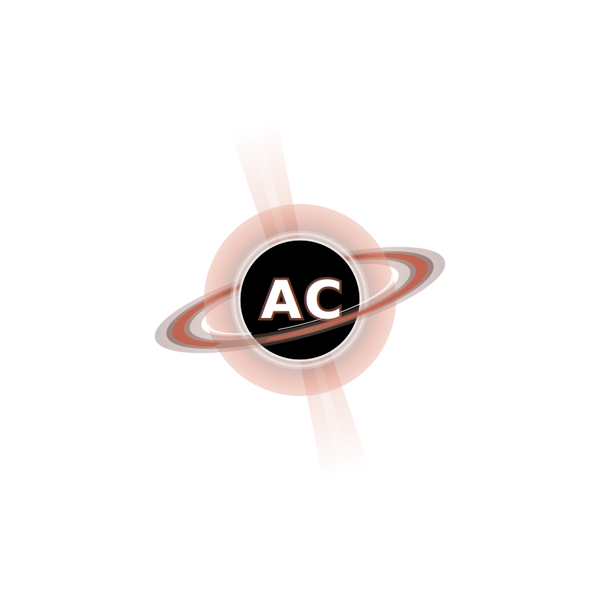

# PlotCraft

**Better diagrams from your AI.** PlotCraft is a Python library that gives LLMs the ability to create clean, well-designed diagrams. You describe what you want, PlotCraft handles the layout and rendering.

## Why?

AI-generated diagrams usually look terrible — misaligned text, arrows through shapes, everything the same size. PlotCraft fixes this by using [D2](https://d2lang.com) for intelligent layout and hand-drawn sketch rendering. The AI writes simple Python, D2 does the visual design.

## Install

```bash
pip install plotcraft
```

You'll also need D2 for rendering:

```bash
# macOS
brew install d2

# Linux
curl -fsSL https://d2lang.com/install.sh | sh
```

## Quick Start

```python
from plotcraft import Scene

s = Scene()
s.add("How HTTPS keeps your data safe", role="title")
s.add("You type a URL", role="start")
s.add("TLS Handshake", role="process", emphasis="high")
s.add("Certificate Check", role="decision")
s.add("Encrypted Tunnel", role="process", size="large", emphasis="high")
s.add("Page Loads", role="end")

s.connect("You type a URL", "TLS Handshake")
s.connect("TLS Handshake", "Certificate Check")
s.connect("Certificate Check", "Encrypted Tunnel", label="valid")
s.connect("Encrypted Tunnel", "Page Loads")

s.annotate("AES-256 encryption", near="Encrypted Tunnel")
s.add("Every request, invisible, in milliseconds", role="caption")

s.layout("pipeline")
s.save("https.png")
```

## How It Works

1. **You describe elements** — give each a role (`start`, `process`, `decision`, `end`) and optionally `emphasis` and `size`
2. **You connect them** — PlotCraft figures out the arrow routing
3. **You pick a layout** — `pipeline`, `top_down`, `fan_out`, `cycle`, `decision_tree`, `convergence`
4. **D2 renders it** — sketch mode for a hand-drawn aesthetic, dagre for intelligent positioning

No coordinates. No anchor points. No grid cells. Just content and relationships.

## Themes

PlotCraft ships with 9 color themes:

```python
Scene(theme="default")   # clean blues
Scene(theme="earth")     # warm browns
Scene(theme="grape")     # rich purples
Scene(theme="ocean")     # cool teals
Scene(theme="vanilla")   # soft yellows
Scene(theme="cool")      # muted pastels
Scene(theme="mixed")     # colorful variety
Scene(dark=True)         # dark mode
```

Run `python examples/gallery.py` to see all themes rendered side-by-side.

## API Reference

```python
from plotcraft import Scene

# Create a scene
s = Scene(
    dark=False,          # dark mode
    theme="default",     # color scheme
)

# Add elements
s.add(text,
    role="process",      # title, subtitle, start, end, process, decision, caption
    size="medium",       # small, medium, large, hero
    emphasis="normal",   # low, normal, high
)

# Connect elements (by their text)
s.connect(source, target,
    label=None,          # text on the arrow
    style="solid",       # solid, dashed, dotted
    weight="normal",     # thin, normal, bold
)

# Add floating annotations
s.annotate(text, near=element_text)

# Choose layout and render
s.layout("pipeline")     # pipeline, top_down, fan_out, convergence, cycle, decision_tree
s.save("diagram.png")    # .png, .svg, .d2, .excalidraw
```

## Element Roles

| Role | Shape | Best for |
|------|-------|----------|
| `"title"` | floating text | Diagram title — states the insight |
| `"subtitle"` | floating text | Section headers |
| `"start"` | oval | Entry points, triggers |
| `"end"` | oval | Results, outcomes |
| `"process"` | rectangle | Steps, actions, states |
| `"decision"` | diamond | Branch points, conditions |
| `"caption"` | floating text | Closing insight |

## Examples

```bash
# Generate the full gallery (12 diagrams across 6 subjects and 6 themes)
uv run python examples/gallery.py
```

## Claude Code Skill

PlotCraft includes a Claude Code skill at `skills/plotcraft-diagram/` that teaches AI assistants the design methodology — when to use which layout, how to pick roles, and how to write effective diagram titles.

## Development

```bash
git clone https://github.com/your-username/plotcraft
cd plotcraft
uv sync
uv run pytest
```

---

<p align="center">
  <a href="https://github.com/ashwinchidambaram"></a>
</p>
