# PlotCraft Examples

A gallery of every diagram type PlotCraft can produce. Each section shows the rendered output, the prompt you'd give Claude Code, and the underlying Python code.

All renders live in [`renders/`](renders/) and are regenerated by:

```bash
uv run python examples/render_readme_gallery.py     # 7 templates
uv run python examples/render_scene_showcase.py     # 4 Scene API showcases
uv run python examples/test_all_templates.py        # full smoke test (templates + themes)
```

---

## The 7 Templates

The fastest path to a diagram. Each template wraps the Scene API in a fluent builder.

### Pipeline — sequential steps

> *"Show me how the immune system fights an infection."*

<div align="center">
  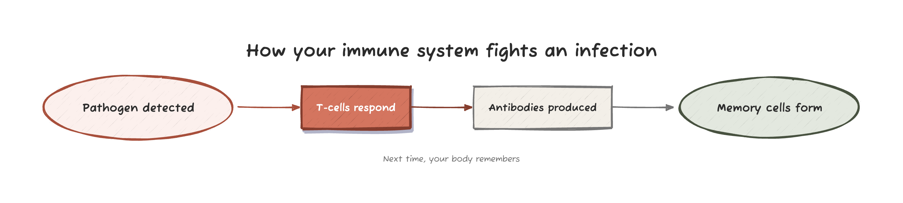
</div>

```python
from plotcraft import Pipeline

Pipeline("How your immune system fights an infection") \
    .step("Pathogen detected") \
    .step("T-cells respond", emphasize=True) \
    .step("Antibodies produced") \
    .step("Memory cells form") \
    .caption("Next time, your body remembers") \
    .save("immune.png")
```

---

### DecisionTree — branching choice

> *"Are you out of Claude Code usage? Show the options."*

<div align="center">
  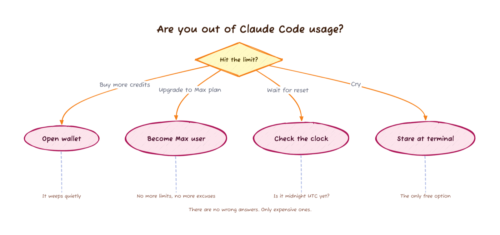
</div>

```python
from plotcraft import DecisionTree

DecisionTree("Are you out of Claude Code usage?", theme="sunset") \
    .question("Hit the limit?") \
    .branch("Buy more credits", "Open wallet", note="It weeps quietly") \
    .branch("Upgrade to Max plan", "Become Max user", note="No more limits") \
    .branch("Wait for reset", "Check the clock", note="Is it midnight UTC yet?") \
    .branch("Cry", "Stare at terminal", note="The only free option") \
    .caption("There are no wrong answers. Only expensive ones.") \
    .save("limit.png")
```

---

### Comparison — side-by-side options

> *"Compare iPhone vs Android side by side, three points each."*

<div align="center">
  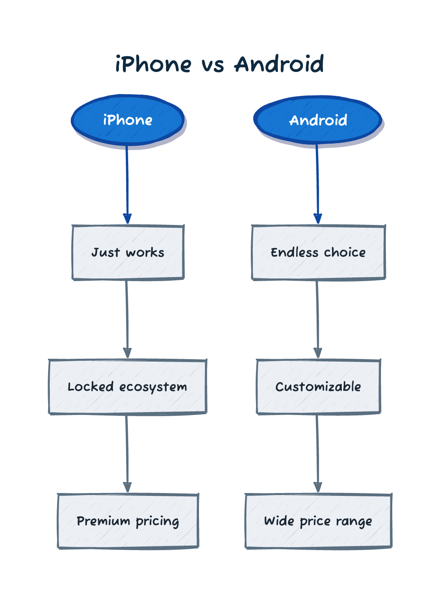
</div>

```python
from plotcraft import Comparison

Comparison("iPhone vs Android", theme="ocean") \
    .option("iPhone", points=["Just works", "Locked ecosystem", "Premium pricing"]) \
    .option("Android", points=["Endless choice", "Customizable", "Wide price range"]) \
    .save("phones.png")
```

---

### Cycle — feedback loops

> *"Visualize the writer's revision loop — draft, get feedback, revise, repeat."*

<div align="center">
  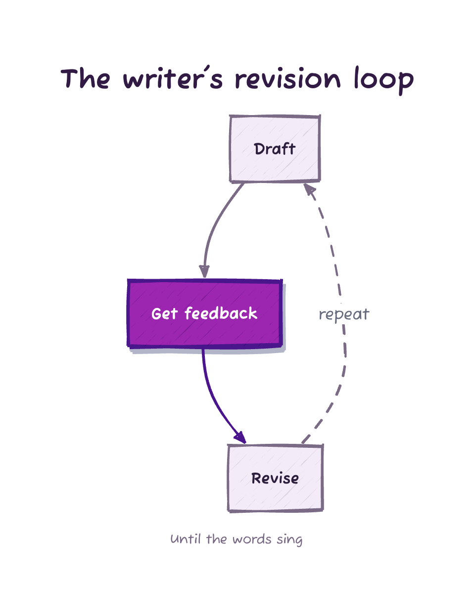
</div>

```python
from plotcraft import Cycle

Cycle("The writer's revision loop", theme="grape") \
    .step("Draft") \
    .step("Get feedback", emphasize=True) \
    .step("Revise") \
    .feedback("repeat") \
    .caption("Until the words sing") \
    .save("revision.png")
```

---

### FanOut — one source to many targets

> *"What happens when I press send on an email? Show every place it goes."*

<div align="center">
  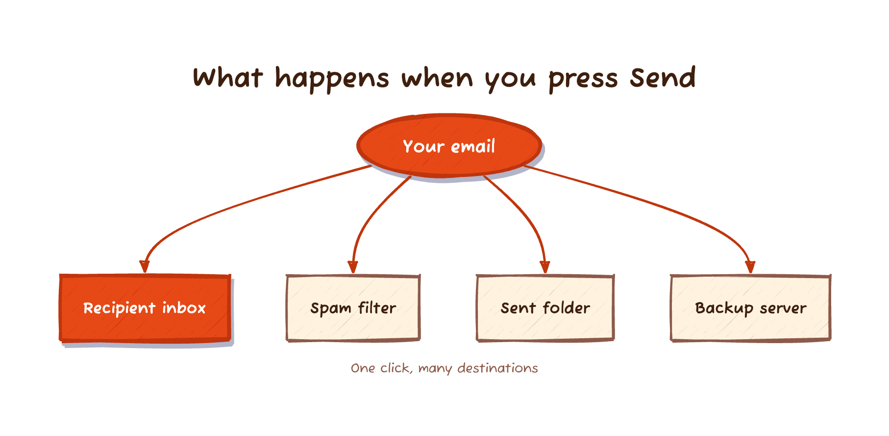
</div>

```python
from plotcraft import FanOut

FanOut("What happens when you press Send", theme="sunset") \
    .source("Your email") \
    .target("Recipient inbox", emphasize=True) \
    .target("Spam filter") \
    .target("Sent folder") \
    .target("Backup server") \
    .caption("One click, many destinations") \
    .save("email.png")
```

---

### Architecture — multi-tier system

> *"Show me how a restaurant works: front of house, kitchen, suppliers."*

<div align="center">
  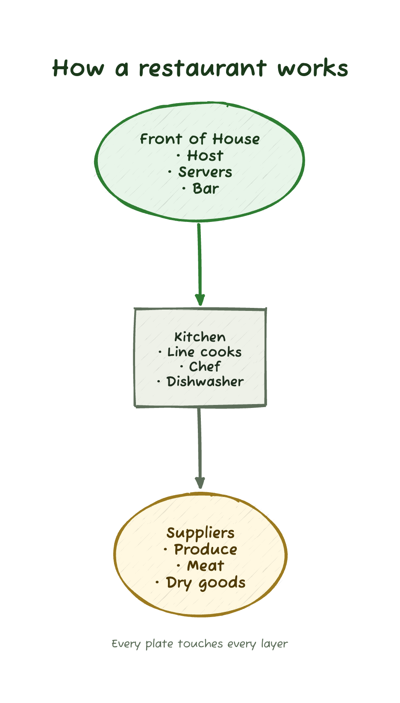
</div>

```python
from plotcraft import Architecture

Architecture("How a restaurant works", theme="forest") \
    .tier("Front of House", ["Host", "Servers", "Bar"]) \
    .tier("Kitchen", ["Line cooks", "Chef", "Dishwasher"]) \
    .tier("Suppliers", ["Produce", "Meat", "Dry goods"]) \
    .caption("Every plate touches every layer") \
    .save("restaurant.png")
```

---

### Timeline — events in order

> *"Make a timeline of a product launch year."*

<div align="center">
  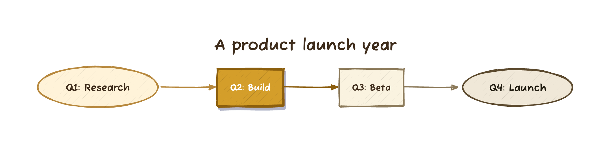
</div>

```python
from plotcraft import Timeline

Timeline("A product launch year", theme="vanilla") \
    .event("Q1", "Research") \
    .event("Q2", "Build", emphasize=True) \
    .event("Q3", "Beta") \
    .event("Q4", "Launch") \
    .save("roadmap.png")
```

---

## Scene API Showcases

When templates can't capture the structure (multiple endpoints, cross-cutting feedback loops, parallel paths), the Scene API gives you full control over elements and connections without forcing you to compute coordinates.

### Branching with feedback — life cycle of a star

> *"Diagram the life cycle of a star, including what happens to high-mass and low-mass stars."*

<div align="center">
  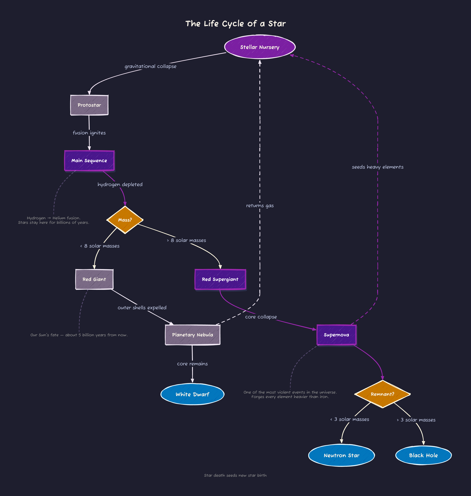
</div>

Highlights: two decision diamonds (mass? remnant?), three terminal endpoints (white dwarf, neutron star, black hole), dashed feedback arrows showing how stellar death seeds new stellar birth, and floating annotations explaining the science.

See [`render_scene_showcase.py`](render_scene_showcase.py) for the full code (~50 lines).

---

### Big feedback loop — TikTok's recommendation algorithm

> *"Explain how TikTok's recommendation algorithm decides what to show me."*

<div align="center">
  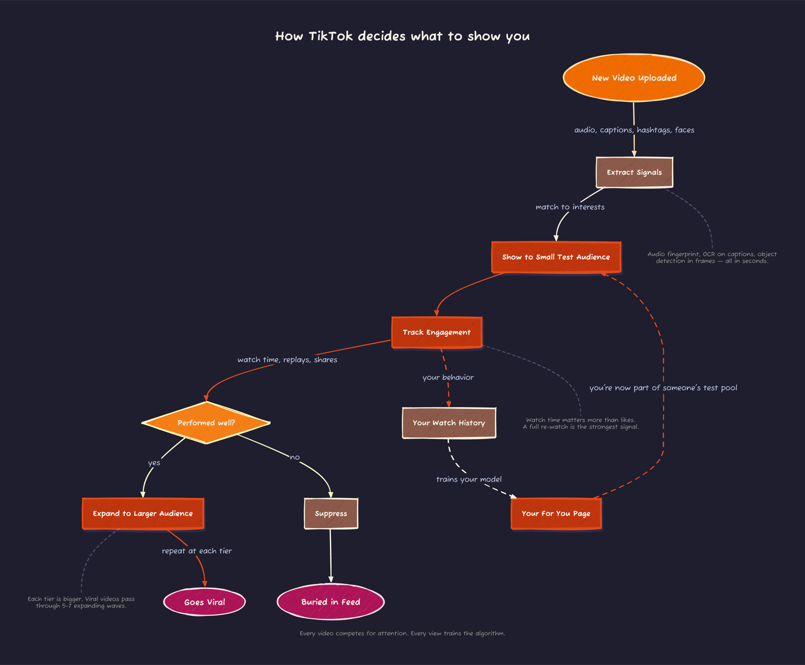
</div>

Highlights: a multi-stage forward flow (upload → signals → small audience → engagement), a yes/no decision (performed well?) splitting to "viral" or "buried," and a personal feedback loop showing how your watch history feeds back into the test pool for *other* users' videos.

See [`render_scene_showcase.py`](render_scene_showcase.py) for the full code.

---

## Color Palettes

Every template, Scene, and Canvas accepts a `theme=` parameter. Pick one of the 8 built-ins or define your own [`Palette`](../src/plotcraft/scene.py).

<div align="center">
  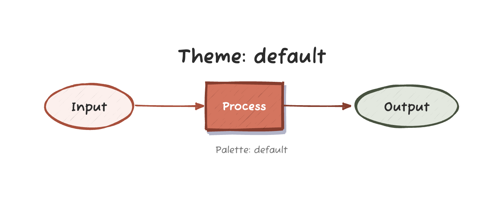
  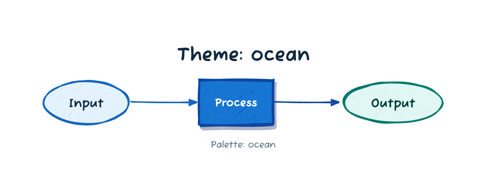
  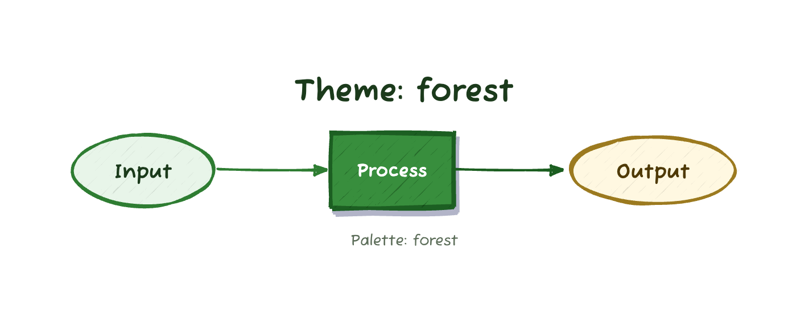
  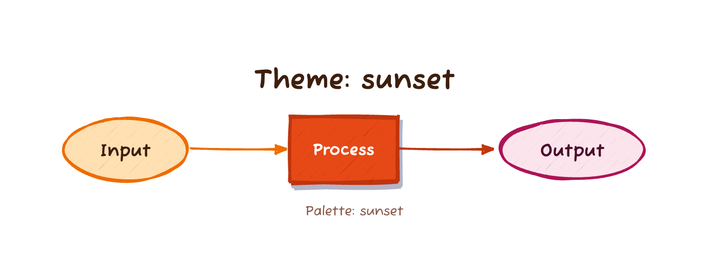
</div>
<div align="center">
  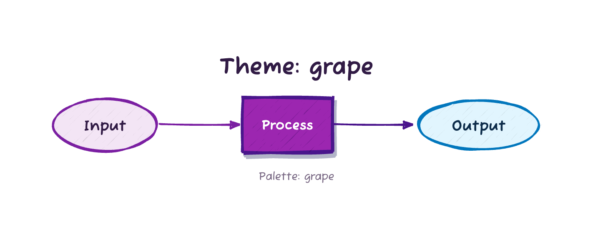
  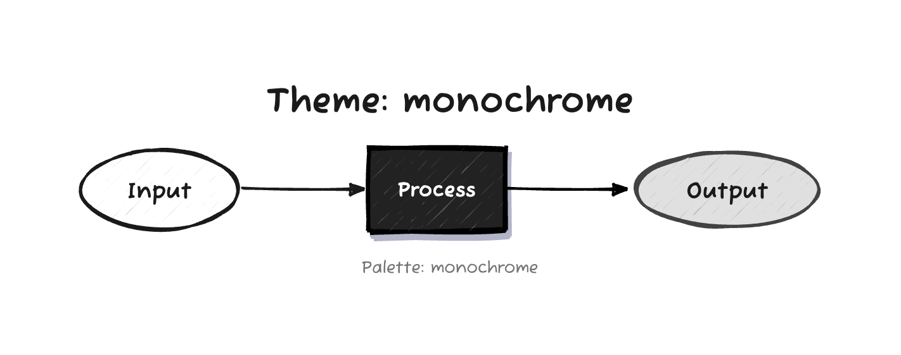
  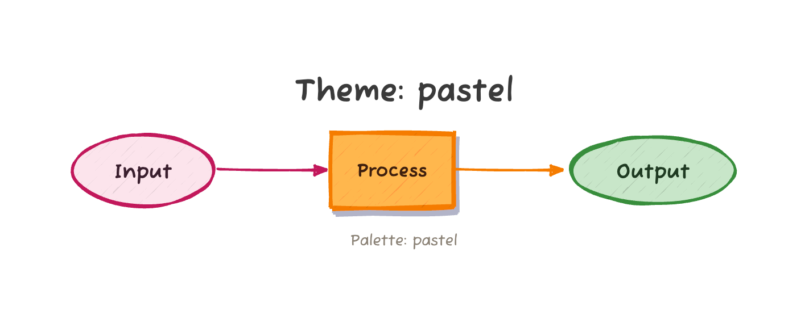
  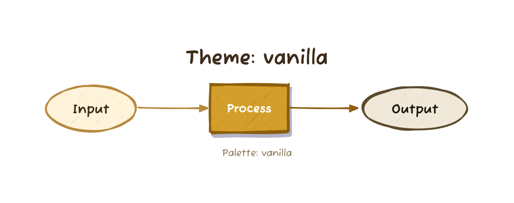
</div>

```python
Pipeline("Title", theme="ocean").step("A").step("B").save("out.png")
```

### Custom palette

<div align="center">
  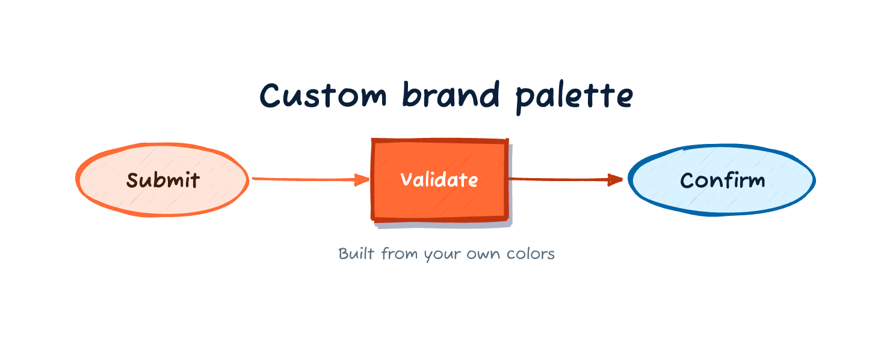
</div>

```python
from plotcraft import Pipeline, Palette

brand = Palette(
    name="my-brand",
    canvas="#FFFFFF",
    title_color="#0B1F3A",
    subtitle_color="#FF6B35",
    start=("#FFE5D9", "#FF6B35", "#3E1F0E"),
    end=("#D9F2FF", "#0066AA", "#0B1F3A"),
    process=("#F5F5F5", "#444444", "#1A1A1A"),
    decision=("#FFF8E1", "#F9A825", "#5C3A00"),
    high=("#FF6B35", "#BF360C", "#FFFFFF"),
)

Pipeline("Custom brand", theme=brand) \
    .step("Submit").step("Validate", emphasize=True).step("Confirm") \
    .save("brand.png")
```

### Dark mode

<div align="center">
  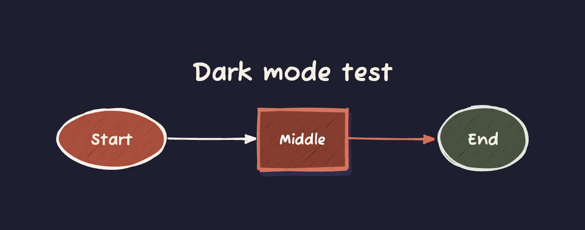
</div>

```python
Pipeline("Dark mode test", dark=True) \
    .step("Start").step("Middle", emphasize=True).step("End") \
    .save("dark.png")
```

---

## Example Scripts

| Script | What it produces |
| --- | --- |
| [`render_readme_gallery.py`](render_readme_gallery.py) | The 7 template diagrams used in the main README |
| [`render_scene_showcase.py`](render_scene_showcase.py) | The 3 Scene API showcases (star lifecycle, water cycle, TikTok) plus the Claude Code meme |
| [`test_all_templates.py`](test_all_templates.py) | End-to-end smoke test: every template + every theme + dark mode + custom palette |
| [`showcase.py`](showcase.py) | The original Scene API showcase set (compiler, packet, neural net, etc.) |
| [`gallery.py`](gallery.py) | Mixed Scene/Canvas examples |

---

## Beyond templates and Scene — Canvas API

For genuinely custom infographics — slime molds, tournament brackets, evolutionary trees — PlotCraft has a `Canvas` API that gives pixel-precise spatial control. See the [GEPA project](https://github.com/ashwinchidambaram/gepa-mutations) for examples in the wild, or [`gallery.py`](gallery.py) in this directory.
